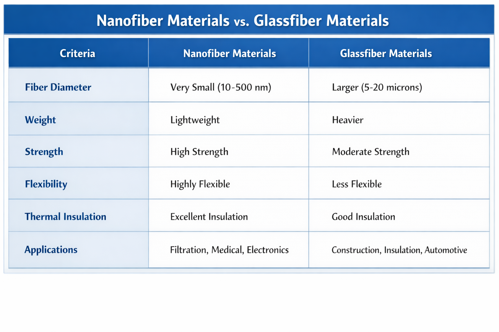
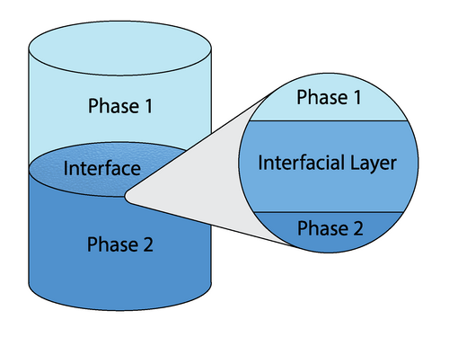
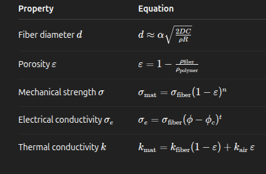
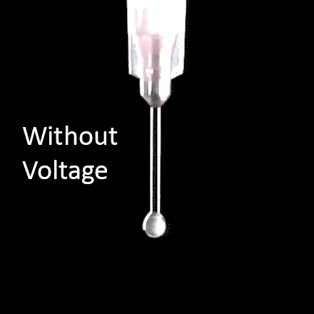
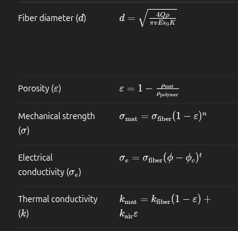
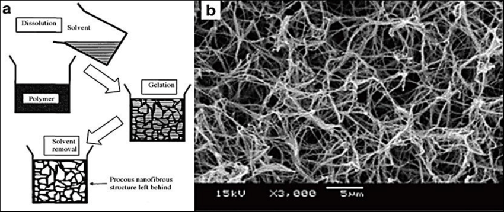
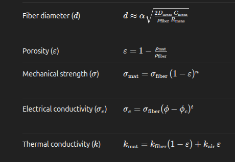

# Nanofiber Materials

## Definition
- Nanofiber materials are materials that have at least one dimension below 100 nm unlike glass fibers that exist in the micron range. among o

## Properties

### Thickness (fiber diameter d)
- The thickness of the nanofiber should be suiting to its application 
- as the thickness decreases its surface area is higher resulting in a better adsorption and reactivity (suitable for sensors)
- while a higher thickness would be more suitable for reinforcement and structual composites (stronger and easier to handle)

### Porosity 
fraction of void space in the fiber pat .
matters as high porosity means better flow,diffusion and surface exposure but lower mechanical strength

### Electrical and thermal conductivity 
depends mainly on the type of the material used but also the resulting fiber diameter and porosity 

## Manufacturing 
- Nanofibers can be  created by
    1. synthesizing by interfacial polymerization : [2]
        where two immiscible  liquids meet -usually water and oil -  each containing a different chemical

        since the two liquids picked don't mix the reaction of the chemicals occurs only at the boundary forming a polymer chain

        since the reaction is only confined at the boundary area(almost 2D) , the polymer created is very thin

        

        
    
    
    2.  Electrospinning                             [3]
        by injecting a liquid [solvent + polymer] inside a syringe needle , initially the liquid comes of the tip of the syringe needled .

        without voltage : a droplet is created and the liquid is held in position by surface tension.

        with applying very high positive voltage to the needle and grounding or negative biasing the metal plate 
        
        due to the high electric field , the liquid get stretched into a cone known as "Taylor cone"

        the solvent then evaporates due to the stretching and what's left on the metal is the solid very thin polymer

        

        

    3.  Phase Separation 
        a method that creates a porous nanofiber.

        you start with a polymer solution(a polymer dissolved in solvent) , 

        then by applying temperature changes, Solvent evaporation or solvent-Non-solvent interaction :

        the polymer separates into two phases ,
            a polymer-rich phase which forms the solid fiber network and the solvent-rich phase which creates the pores when removed 
        

        
        
        

## How would machine learning be beneficial 
- As seen by the equations for the three methods mentioned , and by observing 
article[4] , it can be seen clearly that each method depends on a set of parameters to obtain which aren't linearly related.
therefore its hard to decide the output -taking into consideration- the environmental factors , that would result in the wanted output 

machine learning can help by building a model that's trained on a dataset of many input/output trials preferably in real life but i think also simulations will work.
then by fixing some parameters and feeding the trained model the environmental values it should be able to detect how we should tune the other parameters to observe the wanted output .

# References
https://www.sciencedirect.com/topics/materials-science/nanofiber [1]

https://en.wikipedia.org/wiki/Interfacial_polymerization[2]

https://www.youtube.com/watch?v=GbiC49VsLI8 - https://www.nanoscience.com/techniques/electrospinning/[3]

https://www.sciencedirect.com/science/article/pii/S26668939220007794[4]